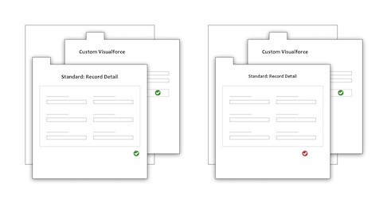
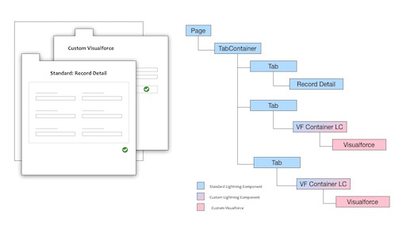
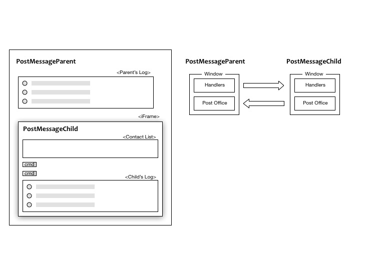
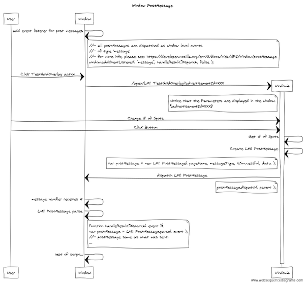
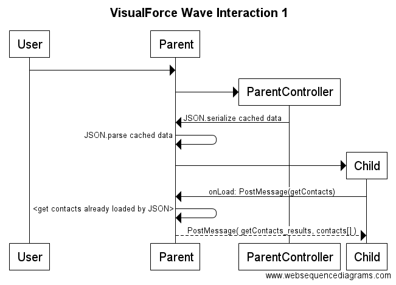
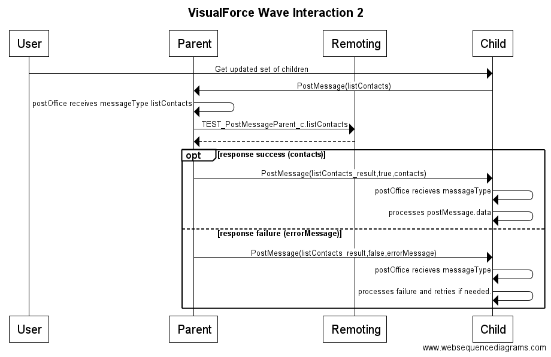
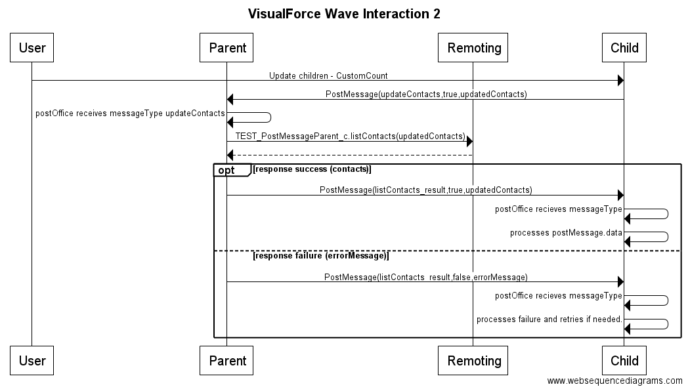

# Overview

As a Lightning Experience end user, when I make a change to a field in Visualforce, I want to see that change reflected in the Record Detail or the Highlights Panel.

In the inverse of the other issue, when I make a change in Visualforce
There isn’t a standard means to update the values in the rest of the Lightning Experience.
(it still shows the old value / Inconsistency)

This can cause confusion and loss of confidence, as the end user isn’t sure if the change was actually made.

Or the user has to refresh the page each time a change was made, which causes more than a little frustration.

---

#### Purpose

This repo helps to solve this through the following:

** Custom Lightning Component: LNE_VisualforceContainer **

This is a Lighting Component that can be reused wherever the standard Lightning Visualforce Component is used.

It supports receiving LNE_PostMessages from the contained iFrame (visualforce or otherwise)
and directs those events to other windows or to Lightning.

** Static Resource: contains LNE_PostMessage and LNE_MessagePostOffice classes **

Static Resource that contains the classes used below, including the LNE_PostMessage and LNE_MessagePostOffice - used in the component.

--

The included demo example provides 3 main scenarios for communicating between domains:

* pre-loading data from visualforce - with a simple message response
* requesting data from a JS Remoting call
* performing a data update with additional parameters.

Navigate to the [Demo Section](#Demo) for more details.

# Included Helpers

#### LNE_PostMessage2

LNE_PostMessage is a JavaScript class that provides a way to send a message from one window to another.

By creating the LNE_PostMessage2, you can dispatch that event to another window and then receive and parse to have the exact same message dispatched.

It also provides additonal helper functions to specify the page it was sent from, and message type - along with filter functions to validate on the receiving side.

The LNE_PostMessage is available from any visualforce page by including:

	<apex:includeScript value='{!URLFOR($Resource.LNE_GeneralResources,"js/events/LNE_PostMessage2.js")}' />
		
Example dispatch:

	var pageName = 'LNE_TestPostMessage';
	var method = 'saveAttempted';
	var isSuccessful = true;
	var data = { userId: 'someId', someSetting: 23 };
	var m = new LNE_PostMessage( pageName, method, isSuccessful, data );
	
Or all in one line

	new LNE_PostMessage( 'LNE_TestPostMessage','saveComplete',true,{src:window.location.href}).dispatch( parent );
		
To receive events, all that is needed is to listen for 'message' events on the window:

	//-- all postMessages are dispatched as window level events
	//-- of type 'message'
	window.addEventListener( "message", handleResultDispatch, false );
	
	function handleResultDispatch( evt ){
		var postMessage = LNE_PostMessage.parse( evt );
		
		if( postMessage ){
			postMessage.matchesPageMessage( 'LNE_TestPostPage','saveAttempted' )){
			console.log( 'user:' + postMessage.data.userId );
			console.log( 'someSetting:' + postMessage.data.someSetting );
		}
	}

for more info, please see: [https://developer.mozilla.org/en-US/docs/Web/API/Window/PostMessage](https://developer.mozilla.org/en-US/docs/Web/API/Window/PostMessage)

#### LNE_PostMessage methods

###### constructor( pageName:String, messageType:String, isSuccessful:Boolean, payload:Object|String )

	 Constructs an LNE Post Message (payload).	 
	 @param pageName - String - name of the page
	 @param messageType - String - arbitrary name of the message type to be sent.
	 @param isSuccessful (Boolean) - whether the call was successful or not
	 @param payload (String|Object) - payload to be provided (will be converted to string)

##### dispatch( targetWindow:Window, targetDomain:String = '*' ):void

	 Dispatches the event.
	 @param targetWindow (Window) - target window to dispatch from. i.e. parent
	 @param targetDomain (String) - target domain to accept the request, defaults to '*'
	 @return void
	 
##### parse( evt:PostMessageEvent ):LNE_PostMessage

	 Parses a dispatched Event)
	 @param evt (string - postMessage Event String)
	 @return boolean - whether it was successful (true) or not (false)

##### LNE_PostMessage.getMessageOrigin( evt:PostMessageEvent ):String

	 Determines the origin of a PostMessage event.
	 @return String
	 
##### matchesPageMessage( pageName:String, messageType:String ):boolean

	 *  Whether it matches both the page and the message type
	 *  @param pageName (String)
	 *  @param messageType (String)
	 *  @return boolean - whether the pageName and the messageType both match in a case insensitive manner.

#### Sequence Diagram:

[Web Sequence Diagram](https://www.websequencediagrams.com/?lz=dGl0bGUgV2luZG93IFBvc3RNZXNzYWdlCgpQYXJ0aWNpcGFudCBVc2VyAAQNACsGMQABEzIKCgAWByAtPgAgCDogYWRkIGV2ZW50IGxpc3RlbmVyIGZvciBwb3N0IG0AbQZzCgpub3RlIHJpZ2h0IG9mADQJCi8vLS0gYWxsACoFAIEaB3MgYXJlIGRpc3BhdGNoZWQgYXMgdwCBQQZsZXZlbABoBnMANgZvZiB0eXBlICcAZAcnAE0GZm9yIG1vcmUgaW5mbywgcGxlYXNlIHNlZTogaHR0cHM6Ly9kZXZlbG9wZXIubW96aWxsYS5vcmcvZW4tVVMvZG9jcy9XZWIvQVBJLwCCPQYvAIEXCwoAgQkGLmFkZEV2ZW50TACBcgcoICIAgWsHIiwgaGFuZGxlUmVzdWx0RACBRgcsIGZhbHNlICk7CmVuZCBub3RlCgpVc2VyAIJFDUNsaWNrIFRlc3RHcmlkT3ZlcmxheSBhY3Rpb24AgncMKisAgxIIOiAvYXBleC9MTkVfACkPP2FkdmVydGlzZW1lbnRJZD1YWFgAgwgHbGVmAIMDCzI6Ck5vdGljZSB0aGF0IHRoZSBQYXJhbWV0ZXIAgwkKbGF5ZWQgaW4AGwUAggAHCnsAURN9AIFJGTI6IENoYW5nZSAjIG9mIFNwb3RzABATAIIABUJ1dHQAgWwJMgA3DUdldAA1DAAPFENyZWF0ZSBMTkVfAIV0DQCBaBZ2YQCFMAYAhiEHID0gbmV3AC0QKCBwYWdlTmFtZSwAhVYIVHlwZSwgaXNTdWNjZXNzZnVsLCBkYXRhAINYDgCBMhExOgCFWwkAeigAhhoLLgCGGAgoIHBhcmVudABaFACHGw4AhwYHAIUSB3IgcmVjZWl2ZXMgaXQAh0QVAIIoDyBwYXJzAII1CACHOBJmdW4AhRwFAIVjFSgAiBsHKXsKCQCCVRIAgxEPLgBkBQAqCTsKCQCIIQUAgw8Mc2FtZQCIEgVoYXQgd2FzIHNlbnQuCgkuLi4AgWYfcmVzAIh9BXNjcmlwdC4uLg&s=napkin)

.

#### LNE_MessagePostOffice

LNE_MessagePostOffice is a JavaScript class that provides a very simple way to monitor PostMessages (but mostly geared for managing LNE_PostMessage2 messages )

To listen for LNE_PostMessage2 post messages, all that is needed is the following:

**1: Create an instance of the postOffice**

	//-- instantiate with the scope object (to represent 'this' in any handling)
	this.postOffice = new LNE_MessagePostOffice(this);
	
**2: Add event listener for any LNE_PostMessages based on messageType **

	this.postOffice.addTypeHandler( 'testMessages', function( postMessage ){
		//-- @invariant: an LNE_PostMessage2 was received and has 'messageType' = 'testMessage';
		//-- @invariant: the EXACT object provided in LNE_PostMessage2.data is available here
		//-- as postMessage.data
	)

Repeat this for as many messageTypes as you would like to handle.
	
**3: Optional: add handler for any postMessage that the type is not recognized for**

	this.postOffice.addTypeHandler( null, function( postMessage ){
		console.error( 'an unknown postMessage.type was received:' + postMessage.messageType );
	});
	
**4: Listen for postMessages on the window**

	this.postOffice.listenForPostEvents( window );
	
For an example page that communicates please see

/apex/TEST_PostMessageParent

#### LNE_MessagePostOffice methods

###### constructor( scope:Object )

	 Constructs an LNE Message Post Office
	 example: this.postOffice = new LNE_MessagePostOffice(this);
	 @param scope - Object - The object that represents 'this' within the handlers.

##### addTypeHandler( messageType:[null|string], handler:function ):void

	 Handler for any LNE_PostMessage2 post event that has a matching message type. (or catchall handler if null)
	 example: this.postOffice.addTypeHandler( 'testMessage', function(postMessage){} );
	 @param handler (function(LNE_PostMessage2)) - function that will execute
	 @return void
	 
##### listenForPostevents( window:Window ):void

	 Initiates the PostOffice for listening for PostMessages on that window.
	 example: this.postOffice.listenForPostEvents( window );
	 @param w (Window) window to listen to post messages on.
	 @return void
	 
#Demo

## Whats in the Demo

The demo example provides 3 main scenarios for communicating between domains:

* DEMO_CustomCount__c custom field on Contact
* TEST_PostMessageParent - starting point for the demo
* TEST_PostMessageParent__c custom controller class
* TEST_PostMessageChild - child page contained within the demo
* Contact CustomField - field for the demo to provide a number Contacts (to be incremented)

(Please note that a custom field is added to Contact for the demo)
	 
## Deploying Demo

@TODO: make a separate deployment for just the component and static resource

**1: run `ant makeCredentials` to generate the credentials file**

	ant makeCredentials
	
**2: run `ant test` to do a test deploy**

	ant test
	
**3: run `ant deploy` to deploy the demo to your org**

	ant deploy
	
**4: login and navigate to /apex/TEST_PostMessageParent**

#### 1: Results already in JavaScript

In this case, the parent+child pages load,
and the parent can pre-cache the information the child will ask for.

(In this case by serializing/deserializing through JSON)

[Web Sequence Diagram](https://www.websequencediagrams.com/?lz=dGl0bGUgVmlzdWFsRm9yY2UgV2F2ZSBJbnRlcmFjdGlvbiAxCgpwYXJ0aWNpcGFudCBVc2VyAAQNUGFyZW50AAESdENvbnRyb2xsACEPQ2hpbGQKClVzZXItPgA3BjogCgBABiAtPiAqAC4QOgAWBwBGCiAtPgBwBzogSlNPTi5zZXJpYWxpemUgY2FjaGVkIGRhdGEASQsAIA1wYXJzABUULT4qAIEXBToKAIEeBQBZDG9uTG9hZDogUG9zdE1lc3NhZ2UoZ2UAgV0FYWN0cykAWBM8Z2V0IGMAGgcgYWxyZWFkeSBsb2FkZWQgYnkAgTMFPgCBbgktPgCCEgYAVQ4gAFkLX3Jlc3VsdHMsAEwJW10gKQ&s=default)

#### 2: Request Remoting

The child needs to call a remoting call that isn't available within its domain.

The child sends a postMessage to its parent,
the parent makes a remoting call
and then sends a postMessage to the child '_result'.

The results (the list of contacts)
are added to the data object sent
and so are available in the data object when receiving it.

[Web Sequence Diagram](https://www.websequencediagrams.com/?lz=dGl0bGUgVmlzdWFsRm9yY2UgV2F2ZSBJbnRlcmFjdGlvbiAyCgpwYXJ0aWNpcGFudCBVc2VyAAQNUGFyZW50ABcNUmVtb3RpbmcALA1DaGlsZAoKVXNlci0-AAgFOiBHZXQgdXBkYXRlZCBzZXQgb2YgY2hpbGRyZW4KACsFLT4AWQY6IFBvc3RNZXNzYWdlKGxpc3RDb250YWN0cykKAHsGIC0-AIEEBzogcG9zdE9mZmljZSByZWNlaXZlcyBtADYGVHlwZSAANAwANAsAgS8IOiBURVNUXwBnCwCBXgZfYy4ALQ0AgV8IIC0AcgoKCk9wdCByZXNwb25zZSBzdWNjZXNzIChjAIEmCSAgIACCLQcgLT4AghAGAIFEGl9yZXN1bHQsdHJ1ZSwANg4AgksFADgLAIFnDmllAIFmDwAeFnJvY2Vzc2VzAIIuBQCCWAcuZGF0YQplbHNlAIE-CmZhaWx1cmUgKGVycm9yAIMBBwCBFTdmYWxzZSwANxIAgQNOAIEqCGFuZCByZXRyaWVzIGlmIG5lZWRlZC4KZW5kCg&s=default)

#### 3: Request Update (parameters)

The child needs to update the records
(increase the count within the CustomCount field)

The child takes the list of children already sent,
updates the values and applies it to the data on request.

Just like the data is available for transmitting results,
the data object is available on the initial request.

The parent uses that data in the remoting call,
and transmits the updated results to the child,
so it can update its state.

[Web Sequence Diagram](https://www.websequencediagrams.com/?lz=dGl0bGUgVmlzdWFsRm9yY2UgV2F2ZSBJbnRlcmFjdGlvbiAyCgpwYXJ0aWNpcGFudCBVc2VyAAQNUGFyZW50ABcNUmVtb3RpbmcALA1DaGlsZAoKVXNlci0-AAgFOiBVcGRhdGUgY2hpbGRyZW4gLSBDdXN0b21Db3VudAoALQUtPgBbBjogUG9zdE1lc3NhZ2UodQA0BUNvbnRhY3RzLHRydWUsAA4GZAANCCkKAIEUBiAtPgCBHQc6IHBvc3RPZmZpY2UgcmVjZWl2ZXMgbQBNBlR5cGUgAEkOCgA3CwCBSwg6IFRFU1RfAIEBCwCBegZfYy5saXN0AIEKCACBGgcAgQILAIIMCCAtAIEGCgoKT3B0IHJlc3BvbnNlIHN1Y2Nlc3MgKGMAgToJICAgAIJaByAtPgCCPQYAgXsOAGkMX3Jlc3VsdACBdxcgICAAgn4GAD8LAIICDmllAIIBDwAeFnJvY2Vzc2VzAIJJBQCDCgcuZGF0YQplbHNlAIFFCmZhaWx1cmUgKGVycm9yAIMzBwCBHDdmYWxzZSwANxIAgQNOAIEqCGFuZCByZXRyaWVzIGlmIG5lZWRlZC4KZW5kCg&s=default)